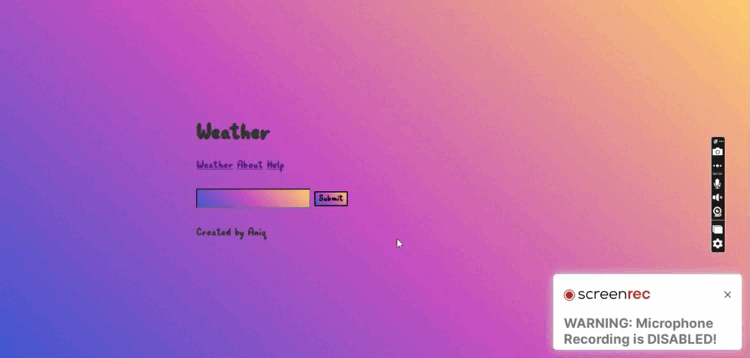

# Weather-Web-Server

### Participants

Github : @AniqJaved 

Discord : AniqJaved#4687

### Description

This is a weather app where you can search the weather details of a particular area. 

### Preview





## Set up Project Requirements

You need following requirement to setup your project:

### Prerequisites

- Node (https://node.org/)

### Install Project

Here are the steps to be taken after that:


1. Clone the repository:

git clone https://github.com/AniqJaved/Weather-Web-Server.git


2. Change directory:
    ```bash
    cd Weather-Web-Server
    ```
3. Install dependencies
    ```bash
    npm install
    ```
4. Start the server
    ```bash
    nodemon src/app.js -e js.hbs
    ```
5. Change directory , install dependencies and start the store-front
    ```bash
    cd ..
    cd my-store-front
    yarn install
    yarn dev
    ```

## Live Preview
Try it out at: https://aniq-weather-application.herokuapp.com/weather


## Further details


### Local Server
To run in a local server use : nodemon src/app.js -e js.hbs

Or

As i have added the nodemon as devdependey so you can simply use: npm start dev

It is becasuse previously we have nodemon as global but then we installed it as: npm i nodemon --save-dev

It means it will run only during the development enviroment. Cool.....


## Code Of Conduct 📜

To maintain a safe and inclusive space for everyone to learn and grow, contributors are advised to follow the [Code of Conduct](https://github.com/AniqJaved/Weather-Web-Server/blob/master/CODE_OF_CONDUCT.md).


# Contribution is fun! ✌🏼

If you have any feedback or suggestions please reach out to me.  

In order to make a hassle-free environment, I implore you all (while contributing) to follow the instructions [Contributing Guidelines](https://github.com/AniqJaved/Weather-Web-Server/blob/master/CONTRIBUTING.md)!

You can create a <a href="https://github.com/AniqJaved/Weather-Web-Server/issues">issue</a> and mention there , which new features or extension can make this Project more good.


<!-- ------------------------------------------------------------------------------------------------------------------------------------------------------------------ -->

<br>
  
<br>

<p align="right"><a href="#top"></a></p>

<div align="center">

### Show some ❤️ by starring⭐ this awesome Repository!

</div>
<br>  

<h1 align=center> OUR VALUABLE CONTRIBUTORS✨ </h1>
<p align="center">
  
	
<a href="https://github.com/AniqJaved/Weather-Web-Server/graphs/contributors">
  
</a>


